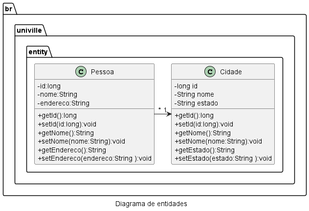

# Fábrica de Software 2025/1

## Repositório dos alunos
- [Repos](https://gist.github.com/bfed97e91a670a0ccb127ad49f1fda12.git)


## Propostas de projeto

- Nome do sistema Ex:(Sistema para Mecânica)
  - Funcionalidade 1 Cadastrar dados do Cliente
  - Funcionalidade 2 Cadastrar veículos
  - Funcionalidade 3
<s>

- Nome do sistema Ex:(Sistema para Mecânica)
  - Funcionalidade 1 Cadastrar dados do Cliente
  - Funcionalidade 2 Cadastrar veículos
  - Funcionalidade 3
</s>

## Livro Eng Software Moderna
[Eng. Soft Moderna - Requisitos](https://engsoftmoderna.info/cap3.html)

## Histórias de Usuário
- Como um Atendente eu gostaria de registrar os dados do cliente como: nome, endereço, telefone, email
- Como um Atendente eu gostaria de registrar os dados do Carro do cliente como: marca, modelo, placa
- Como um Atendente eu gostaria de vincular o Carro ao Cliente
- Como um Atedente eu gostaria de agendar uma revisão com os seguintes dados: cliente, carro, data entrada, data saida, valor da revisão
- Como um Atendente eu gostaria de vincular peças trocadas na revisão com os seguintes dados: codigo, nome, preço unitário
- Como um Atendente eu gostaria de vincular os serviços de mão de obra realizados na revisão com os seguintes dados: nome do funcionário, quantidade de horas, valor

## Comandos do Git

### Instalação
[Git Bash](https://git-scm.com/downloads)

### Configuração inicial

```
git config --global user.name "NOME DO USUARIO NO GITHUB"
git config --global user.email "EMAIL DA CONTA DO GITHUB"
```
### Tipos de mensagens do commit

- feat: (new feature for the user, not a new feature for build script)
- fix: (bug fix for the user, not a fix to a build script)
- docs: (changes to the documentation)
- style: (formatting, missing semi colons, etc; no production code change)
- refactor: (refactoring production code, eg. renaming a variable)
- test: (adding missing tests, refactoring tests; no production code change)
- chore: (updating grunt tasks etc; no production code change)

### Commit e Push

```
git add .
git commit -m "tipo: o que foi feito"
git push -u origin main
```

### Criar um branch a partir da branch atual
```
git checkout -b branch-seunome
```

### Revisão de Java

[Download JDK](https://adoptium.net/)

- JRE - Java Runtime Environment (java.exe)
  - Máquina virtual do Java - interpreta o Bytecode(.class) do Java para linguagem de máquina
- JDK - Java Development Kit (javac.exe)
  - Compilar o código Java em bytecode (.class)

### Criação de projeto no VSCode com Maven
1) teclar F1
2) digitar Java e escolher a opção create new java project
3) project type: MAVEN
4) Archetype: No Archetype
5) pacote digitar domínio ao contrário ex: br.univille
6) nome do projeto em minúsculo
7) usar a pasta sugerida pelo vscode


### Diagrama de classes
